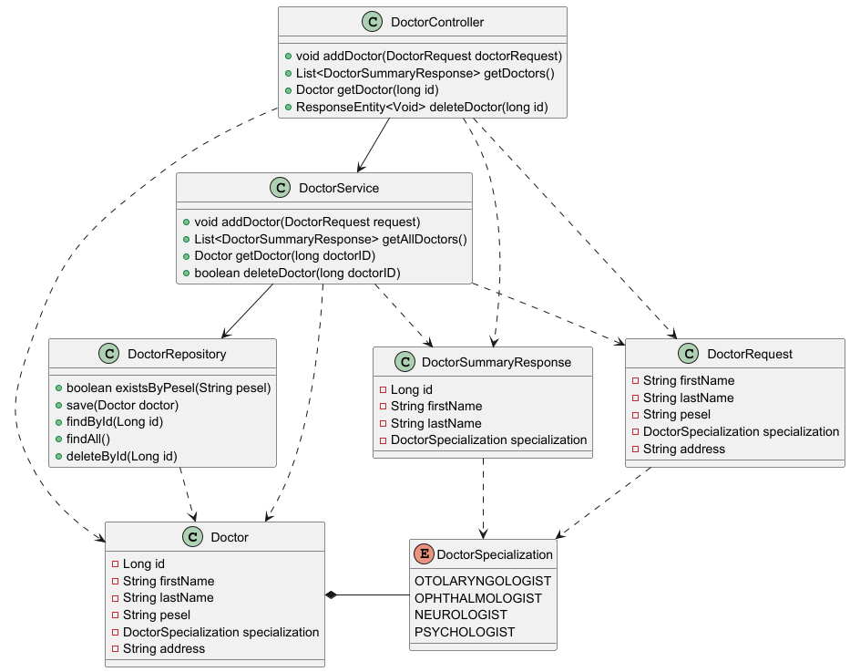
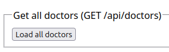
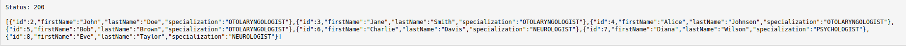
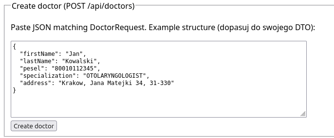
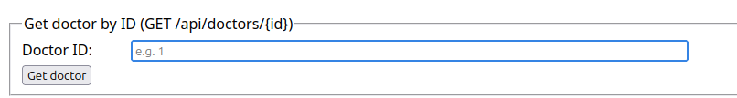
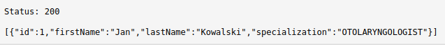
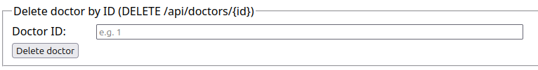

# UML Diagrams

Below are the UML diagrams representing the structure of the project.

## Doctors domain - Class Diagram

# API Documentation - Doctors Service
This document provides instructions on how to use the Doctors Service API through a simple user interface. The Doctors Service allows you to manage doctor records in a database, including listing all doctors, adding new doctors, retrieving specific doctors by ID, and deleting doctors by ID.
## Listing all Doctors
To list all doctors in the database, simply click the "Load all doctors" button below.

If there are no doctors in the database, the returned value will be an empty list.

If the operation is successful, the returned status code should be **200** and the returned value will be a list of all doctors in JSON format.

## Adding new Doctor
To properly add a new Doctor, you need to fill the text field and click "Create doctor" button below when you are ready.

### The program will not allow adding doctors with:
- Empty fields (Status code **400**)
- Duplicate pesels (Status code **409**)
- Fields with only blank spaces (Status code **400**)

If the operation is successful, the returned status code should be **201** and the returned value will be the new doctor's ID.

## Retrieving the Doctor from the Database
To retrieve the doctor with specific ID, you need to supply the text field with ID and then click the "Get doctor" button below. 

If there is no doctor with the supplied ID, the returned status code should be **404**.

If the operation is successful, the returned status code should be **200** and the returned value will be the doctor's data in JSON format.

## Deleting the Doctor from the Database
To delete the doctor with specific ID, you need to supply the text field with ID and then click the "Delete doctor" button below.

If there is no doctor with the supplied ID, the returned status code should be **404**.

If the operation is successful, the returned status code should be **204**.
