# Clinic Management System

A comprehensive system for managing clinic operations, including doctors, patients, exam rooms, duties, and visits.
## Technologies Used
- **Java** (Spring Boot) for backend development
- **Gradle** for dependency management
- **HTML & javascript** for simple user interface 
- **Swagger** for API documentation
- **H2 Database** for development and testing

## Key Features
- Manage doctors, patients, exam rooms, duties and visits
- RESTful API for seamless integration
- Validation and error handling for robust operations
- UML diagrams for clear system design

## Database
Below is shown the database diagram used in the project.

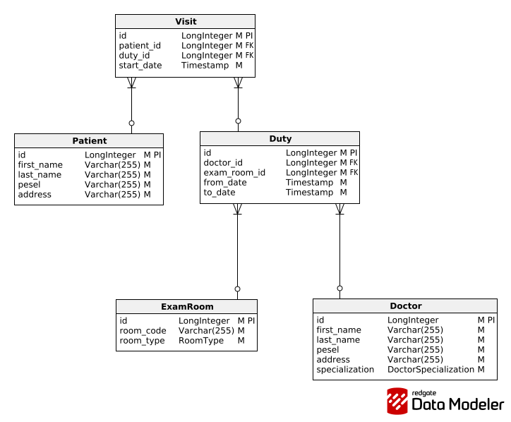

## UML Diagrams

Below are the UML diagrams representing the structure of the project.

### Doctor's domain - Class Diagram
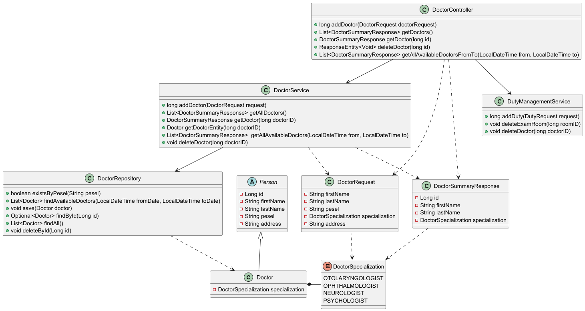

### Exam Room's domain - Class Diagram
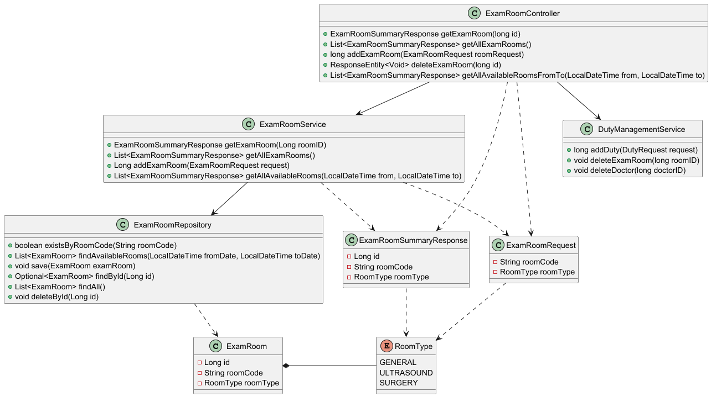

### Patient's domain - Class Diagram
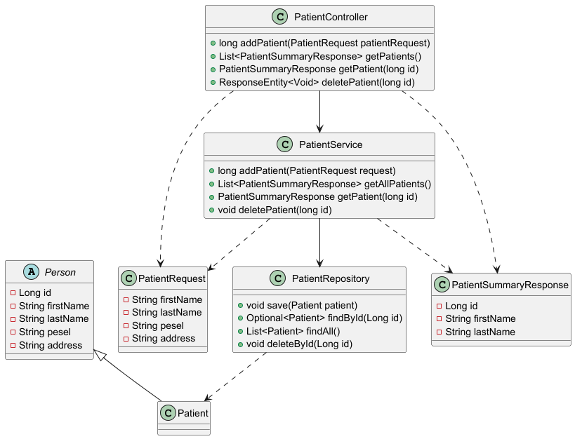

### Duty's domain - Class Diagram
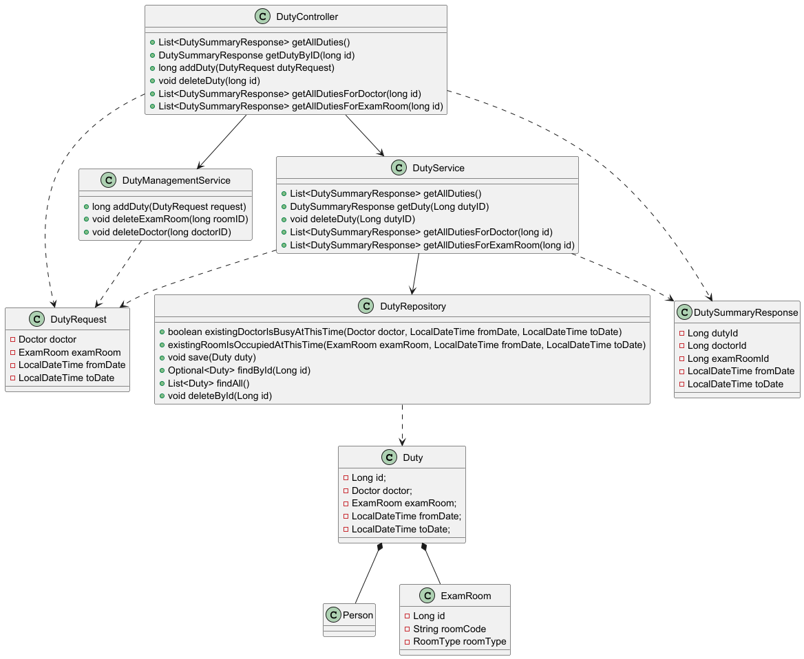

### Visit's domain - Class Diagram
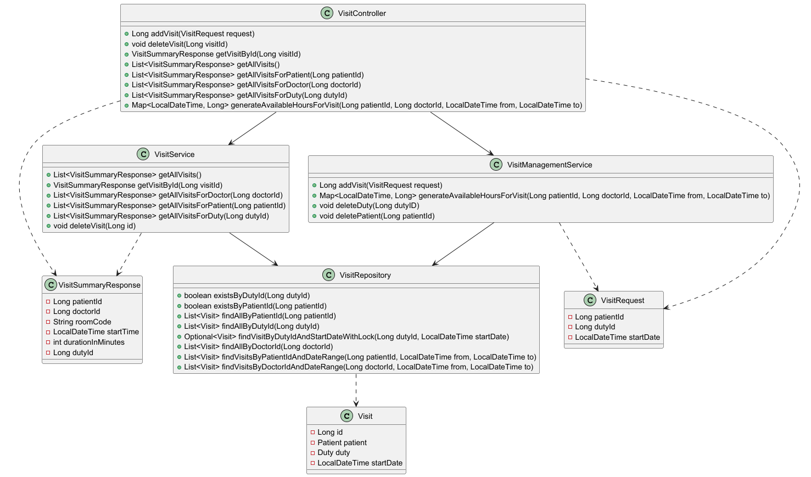

### Duty Management Service's - Helper Class Diagram
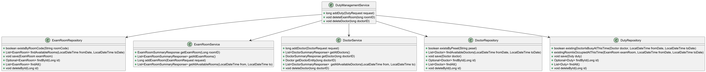
## API Documentation - Doctors Service
The Doctors Service allows you to manage doctor records in a database, including listing all doctors, adding new doctors, retrieving specific doctors by ID, and deleting doctors by ID.
### Listing all Doctors
To list all doctors in the database, simply click the "Load all doctors" button below.

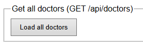

If there are no doctors in the database, the returned value will be an empty list.

If the operation is successful, the returned status code should be **200** and the returned value will be a list of all doctors in JSON format.

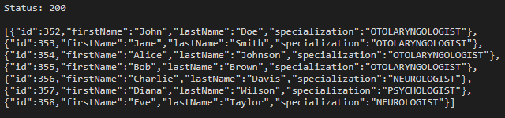

### Adding new Doctor
To properly add a new Doctor, you need to fill the text field and click "Create doctor" button below when you are ready.

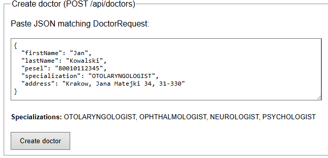

#### The program will not allow adding doctors with:
- Empty fields (Status code **400**)
- Duplicate pesels (Status code **409**)
- Fields with only blank spaces (Status code **400**)

If the operation is successful, the returned status code should be **201** and the returned value will be the new doctor's ID.

### Retrieving the Doctor from the Database
To retrieve the doctor with specific ID, you need to supply the text field with ID and then click the "Get doctor" button below. 

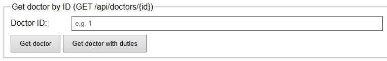

If there is no doctor with the supplied ID, the returned status code should be **404**.

If the operation is successful, the returned status code should be **200** and the returned value will be the doctor's data in JSON format.

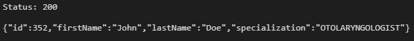

### Retrieving the Doctor with their duties
To retrieve the doctor with specific ID, you need to supply the text field with ID and then click the "Get doctor with duties" button below.

If there is no doctor with the supplied ID, the returned status code should be **404**.

If the operation is successful, the returned status code should be **200** and the returned value will be the doctor's data in JSON format and list of their duties below.

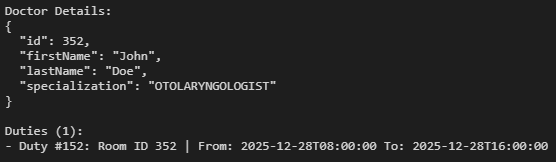

### Deleting the Doctor from the Database
To delete the doctor with specific ID, you need to supply the text field with ID and then click the "Delete doctor" button below.

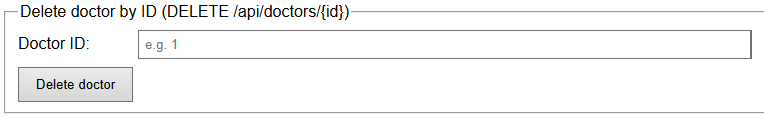

If there is no doctor with the supplied ID, the returned status code should be **404**.

If the operation is successful, the returned status code should be **204**.
## API Documentation - Patient Service
The Patients Service allows you to manage patient records in a database, including listing all patients, adding new patients, retrieving specific patients by ID, and deleting patients by ID.
### Listing all Patients
To list all patients in the database, simply click the "Load all patients" button below.

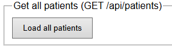

If there are no patients in the database, the returned value will be an empty list.

If the operation is successful, the returned status code should be **200** and the returned value will be a list of all patients in JSON format.

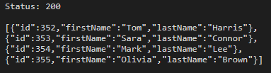

### Adding new Patient
To properly add a new Patient, you need to fill the text field and click "Create patient" button below when you are ready.

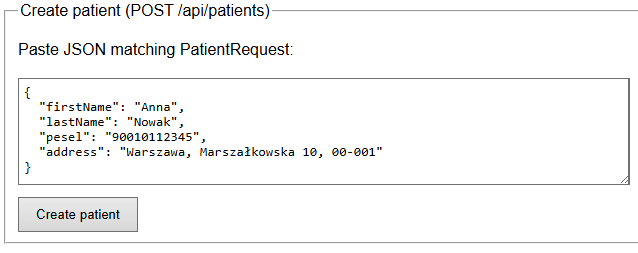

#### The program will not allow adding patients with:
- Empty fields (Status code **400**)
- Duplicate pesels (Status code **409**)
- Fields with only blank spaces (Status code **400**)

If the operation is successful, the returned status code should be **201** and the returned value will be the new patient's ID.

### Retrieving the Patient from the Database
To retrieve the patient with specific ID, you need to supply the text field with ID and then click the "Get patient" button below.

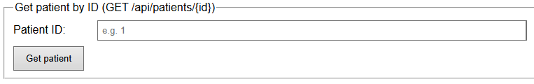

If there is no patient with the supplied ID, the returned status code should be **404**.

If the operation is successful, the returned status code should be **200** and the returned value will be the patient's data in JSON format.

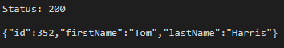

### Deleting the Patient from the Database
To delete the patient with specific ID, you need to supply the text field with ID and then click the "Delete patient" button below.

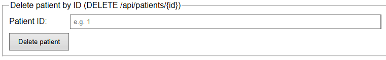

If there is no patient with the supplied ID, the returned status code should be **404**.

## API Documentation - Exam Room Service
The Exam Room Service allows you to manage exam room records in a database, including listing all rooms, adding new rooms, retrieving specific rooms by ID, and deleting rooms by ID.
### Listing all Exam Rooms
To list all rooms in the database, simply click the "Load all exam rooms" button below.

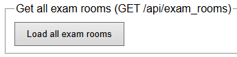

If there are no rooms in the database, the returned value will be an empty list.

If the operation is successful, the returned status code should be **200** and the returned value will be a list of all rooms in JSON format.

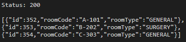

### Adding new Exam Room
To properly add a new room, you need to fill the text field and click "Create exam room" button below when you are ready.

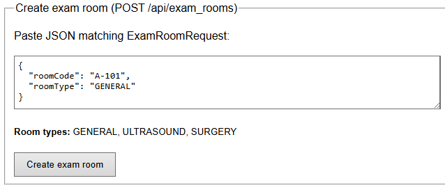

#### The program will not allow adding rooms with:
- Empty fields (Status code **400**)
- Duplicate room code (Status code **409**)
- Fields with only blank spaces (Status code **400**)

If the operation is successful, the returned status code should be **201** and the returned value will be the new room's ID.

### Retrieving the Exam Room from the Database
To retrieve the room with specific ID, you need to supply the text field with ID and then click the "Get exam room" button below.

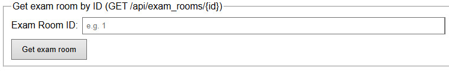

If there is no room with the supplied ID, the returned status code should be **404**.

If the operation is successful, the returned status code should be **200** and the returned value will be the room's data in JSON format.

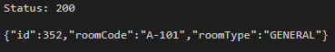

### Retrieving the Exam Room with their duties
To retrieve the room with specific ID, you need to supply the text field with ID and then click the "Get exam room with duties" button below.

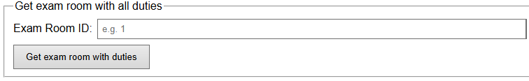

If there is no room with the supplied ID, the returned status code should be **404**.

If the operation is successful, the returned status code should be **200** and the returned value will be the room's data in JSON format and list of its duties below.

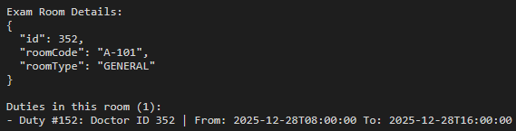

### Deleting the Exam Room from the Database
To delete the room with specific ID, you need to supply the text field with ID and then click the "Delete exam room" button below.

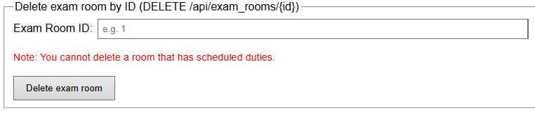

If there is no room with the supplied ID, the returned status code should be **404**.

If the operation is successful, the returned status code should be **204**.

## API Documentation - Duty Service

### Listing all Duties
To list all duties in the database, simply click the "Load all duties" button below.

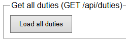

If there are no duties in the database, the returned value will be an empty list.

If the operation is successful, the returned status code should be **200** and the returned value will be a list of all duties in JSON format.

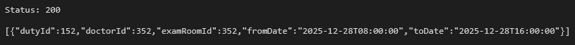

### Adding new Duty
To properly add a new duty, you need to pick the dates between which the duty shall take place.

Next step is to choose an available doctor and room from drop-down lists. If either of these appear to be empty, it means there is no doctor/room available during that time.

Lastly, to create the duty just click the "Create duty" button below.

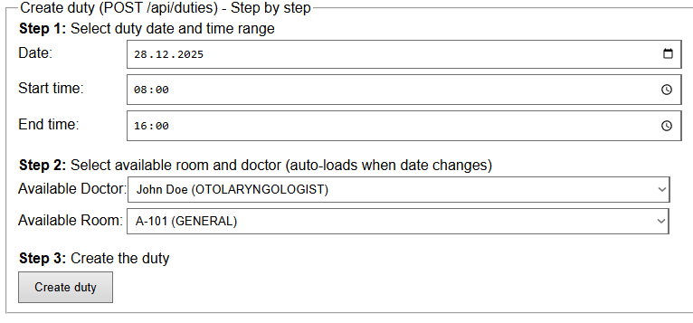

#### The UI will not allow adding duties with:
- No doctor selected
- No room selected

#### The program will not allow adding duties with:
- Start time happening before End time (Status code **400**)
- Duty time window lasting less than an hour (Status code **400**)

If the operation is successful, the returned status code should be **201** and the returned value will be the new duty's ID.

### Optional way of adding Duty
You can also add a duty by filling in the text fields with IDs of an existing doctor and exam room instead of using the drop-down lists. After filling in the IDs, just click the "Create duty" button below.

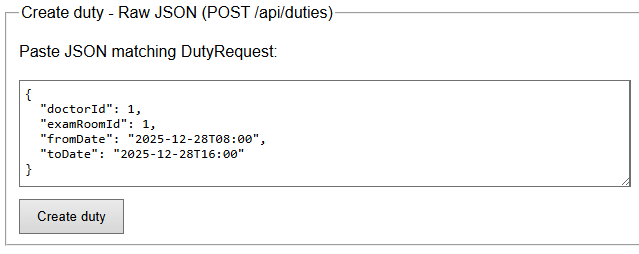

#### The program will not allow adding duties with:
- Non-existing doctor  (Status code **404**)
- Non-existing room (Status code **404**)
- Start time happening before End time (Status code **400**)
- Duty time window lasting less than an hour (Status code **400**)

### Retrieving the Duty from the Database
To retrieve the duty with specific ID, you need to supply the text field with ID and then click the "Get duty" button below.

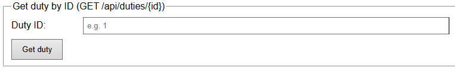

If there is no duty with the supplied ID, the returned status code should be **404**.

If the operation is successful, the returned status code should be **200** and the returned value will be the duty's data in JSON format.

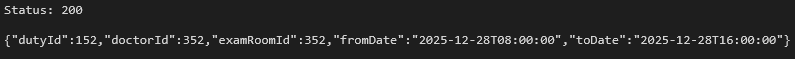

### Deleting the Duty from the Database
To delete the duty with specific ID, you need to supply the text field with ID and then click the "Delete duty" button below.

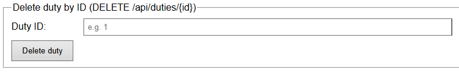

If there is no duty with the supplied ID, the returned status code should be **404**.

If the operation is successful, the returned status code should be **204**.

## API Documentation - Visit Service

### Adding new Visit
To properly add a new visit, you need to pick the patient, the doctor and the dates between which the visit shall take place and then click the "Find available slots" button.

Next step is to choose an available appointment from the shown calendar. If the calendar is empty, it means that the given combination of patient and doctor are unable to make an appointment between these dates.

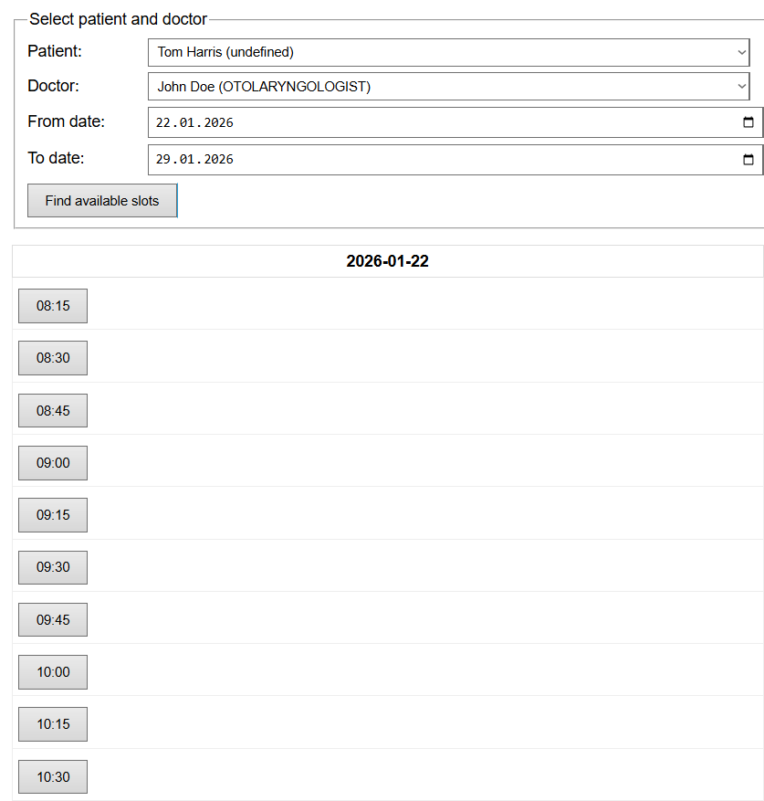

If the operation is successful, the returned status code should be **201** and the returned value will be the new visit's ID.

#### More functionalities of Visit Service are not implemented in the UI yet, but they are possible to try out in Swagger.

## Authors
- [Łukasz Krementowski](https://github.com/Krzeselkoo)
- [Stanisław Brzozowski](https://github.com/grywam7)
- [Aleksander Domagała](https://github.com/aleksdomagala)